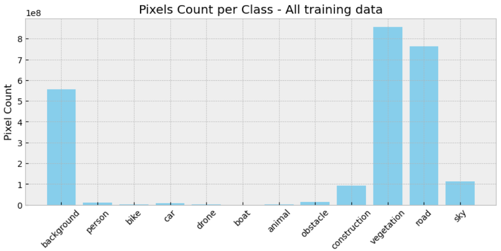

# Multi-Class Semantic Segmentation of Drone Imagery

This is the fourth project of the Opencv University course ["Deep Learning with PyTorch"](https://opencv.org/university/deep-learning-with-pytorch/).
It focuses on applying semantic segmentation on images taken from drones to differentiate between 12 classes.

## Introduction

Semantic segmentation is a foundational computer vision task that assigns a class label to every pixel in an image. This project applies segmentation to drone imagery, addressing challenges such as diverse classes and imbalanced data to classify pixels into 12 categories. Potential applications include autonomous navigation and environmental monitoring.

## Data

The project uses a dataset of 3269 images of size 1280(W) x 720(H), taken by drones, and annotated image masks for 
the following 12 classes: 

    background, person, bike, car, drone, boat, animal, obstacle, construction, vegetation, road, sky

Examples:

One of the challenges of this dataset is the class imbalance. The following image shows the number of pixels per class across the whole dataset:

## The methods used

Fine-tuning a pre-trained DeepLabV3 ResNet-101 model using a custom training loop in PyTorch. The primary objective was to gain hands-on experience with implementing all the steps of the training process in PyTorch.

- The dataset was split using a stratified shuffle split scheme into train and validation subsets with 80% and 20% of the 
available data, respectively. The stratification was done based on the presence or not of a class in each image. 

- Various loss functions were tested, including:
  - The Focal Loss: is a modification of the Cross-Entropy loss focused on learning from hard negative examples.
  - The Soft Dice Loss: is effective in addressing the challenge of imbalanced foreground and background regions.
  - An equally weighted combination of the Focal Loss and the Soft Dice Loss.
  - The Tversky Loss: An improvement over the Dice loss

- A learning rate scheduler that implements the 1-cycle policy. It adjusts the learning rate from an initial rate to a 
maximum, then decreases it to a much lower minimum.

- Custom training loop features:
    - Gradient accumulation
    - Automatic Mixed Precision 
    - Tracking of training/validation losses and scores
    - tracking of per-class scores

## Discussion

The model used is DeeplabV3, trained for 60 epochs with unscaled images (H720 x W1280), which resulted in a Dice Score of `0.79776` on the Kaggle competition Private Set.

See the [notebook](project-4-deep-learning-with-pytorch-2024.ipynb).